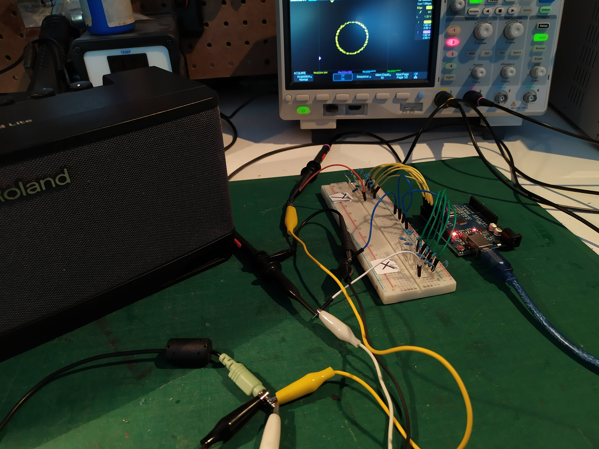

# OscilloscopeArt

Work in progress.

In the video below the oscilloscope is set into XY mode. 
- The Arduino is connected to two 6-bit 2-R2 DACs on the breadboard. One DAC for the X axis and one DAC for the Y axis.
- The analog output from the the DACs is connected to two oscilloscope probes.
- The same analog output is connected in parallel to the left and right channel of a 3.5mm jack which goes to a speaker.

click on the image below to see a demo (https://youtu.be/2zvHPsyfSb4).

